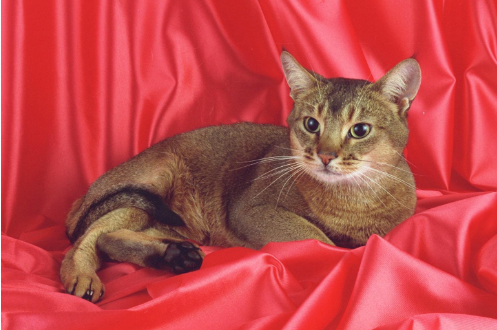
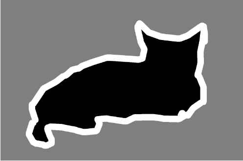
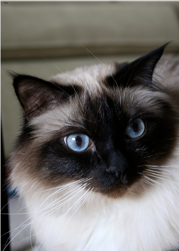
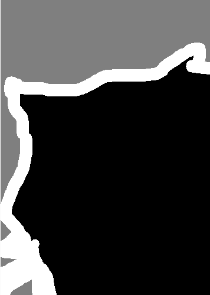
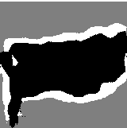
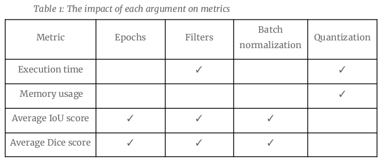

# U-NET convolutional neural network compression
### Objectives
This project is structured to achieve the following objectives:
- Understand the U-Net architecture and its use in image segmentation.
- Use quantization to compress the U-Net model while keeping accuracy high.
- Test the compressed model's performance on CPUs.
- Check how well the compressed model works on different datasets and conditions.
- Analyze and visualize how compression affects output quality, speed, and memory use.

### Dataset
The Oxford-IIIT Pet Dataset is a collection of pet images published by the Visual Geometry Group (VGG) at the University of Oxford. It contains a total of 7,349 images, covering 37 different pet categories, with each category corresponding to a
different breed of dog or cat. Each image has an associated ground truth label indicating the pet's breed and whether it is a cat or dog. Additionally, each image includes annotations for species (cat or dog), breed, and pixel-level segmentation masks.
- Homepage: Oxford-IIIT Pet Dataset
- Source code: tfds.datasets.oxford_iiit_pet.Builder
- Versions: 3.2.0 (default); no version notes.
- Download size: 820 MB

  
  

### Training model
To detail the experimental approach, key factors influencing model performance during training were examined. Two epoch counts were tested: *50* and *100*. Additionally, the number of filters in the U-Net architecture layers was set to *32*, *64*, and *128*. The inclusion of *batch normalization* was also evaluated, with models trained both with and without it. This combination of factors resulted in **12 distinct models**, allowing for a comprehensive examination of their performance differences.

### Compressing Model
Model compression was explored using TensorFlow Lite (TFLite) with two quantization techniques: Float32 (default) and Float16. The performance of 12 models was compared under three scenarios: *no compression*, *Float32 compression*, and *Float16 compression*. For each model, **execution time** and **memory usage** per image prediction were measured, along with **Intersection over Union (IoU)** and **Dice Score**. 

### Loading code

1. First, run the ***model_training.ipynb***.
The output includes : 
- 36 distinct models saved in the *saved_models* folder.
- *trained_models_info.csv*, which contains metrics for each model (e.g., total execution time and memory usage) during the training phase.
- *compressed_models_info.csv*, which adds the size information of each model after compression.
2. Run the ***model_testing.ipynb***.
The output includes:
- *model_performance_individual_results.csv*, which contains the IoU and Dice Score for each image processed by each model.
- *model_performance_average_results.csv*, which provides the average IoU and Dice Score for each model.
3. Run the ***single_testing.ipynb*** to view detailed results for a specific image.

  
  
  
  

### Analysis results

The experimental analysis highlights how various factors influence U-Net model performance:

- Epochs: Increasing epochs significantly impacts IoU and Dice scores but has minimal effect on prediction time and memory usage. Batch normalization improves performance at 50 epochs but is less effective at 100 epochs.
- Filters: Higher filter counts improve IoU and Dice scores but increase prediction time. Memory usage remains unaffected.
- Batch Normalization: Models with 32 filters and 50 epochs, without batch normalization, performed best. Batch normalization can hinder performance in certain conditions due to added complexity.
- Quantization: Contrary to expectations, float16 quantization increased inference time and memory usage compared to non-compressed and float32 models. This was likely due to TensorFlow Lite’s ARM optimizations and Python API thread management limitations.
